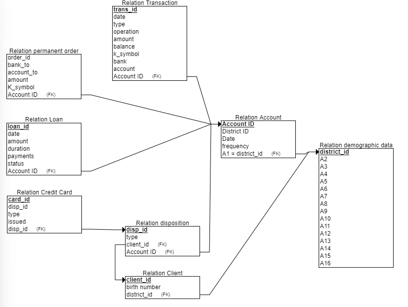
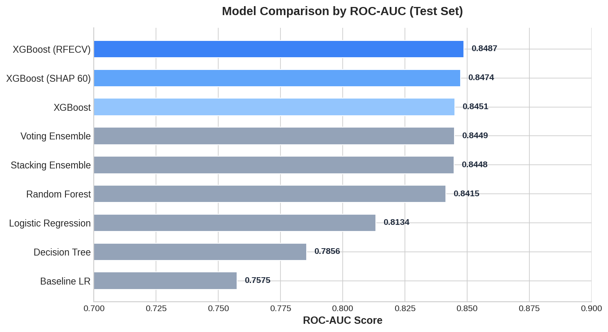
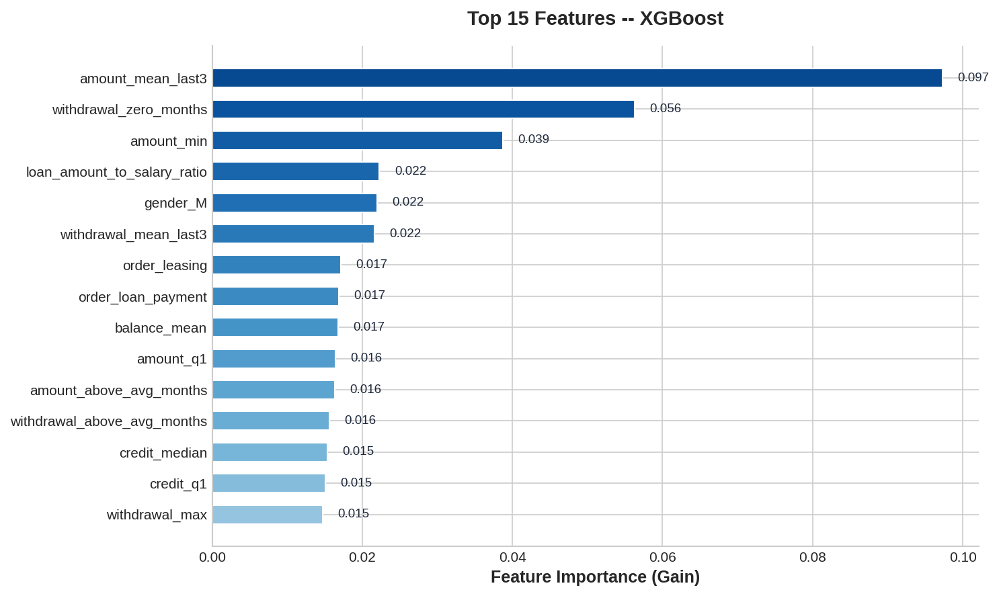

# Credit Card Buyer Prediction

A binary classification model that identifies potential credit card buyers for targeted bank marketing campaigns, built on the Czech Banking Dataset.

## Business Motivation

Acquiring new credit card customers through untargeted campaigns is costly and inefficient. By predicting which existing bank clients are most likely to purchase a credit card, the bank can focus marketing spend on high-probability prospects -- reducing acquisition costs while increasing conversion rates. This project delivers a data-driven scoring model that ranks customers by purchase likelihood, enabling personalized outreach at scale.

## Data

The project uses the [Czech Banking Dataset](https://sorry.vse.cz/~berka/challenge/), a realistic anonymized collection of banking records consisting of 8 interrelated tables:

| Table | Description |
|-------|-------------|
| `account` | Bank account information (opening date, frequency of statements) |
| `client` | Client demographics (birth date, gender, district) |
| `disp` | Disposition linking clients to accounts (owner vs. disponent) |
| `card` | Issued credit cards (type: classic, gold, junior; issue date) |
| `trans` | Transaction records (amounts, balances, types, dates) |
| `order` | Permanent orders (standing payments) |
| `loan` | Granted loans (amount, duration, status) |
| `district` | Demographic data per district (population, unemployment, crime rate) |



## Methodology

```
Raw CSVs ─► Data Cleaning & Wrangling ─► Feature Engineering ─► Preprocessing ─► SMOTE ─► Model Training ─► Evaluation
```

1. **Data Cleaning & Wrangling** -- Join the 8 source tables, handle missing values, parse dates, and resolve data quality issues.
2. **Feature Engineering** -- Aggregate transaction histories into rolling statistics (mean balance, transaction frequency, credit/debit ratios), encode demographic features, and derive loan- and order-based indicators.
3. **Preprocessing** -- Detect skewed distributions and apply log or power transforms, binarize sparse features, and scale all numeric features with `StandardScaler`. Categorical variables are one-hot encoded.
4. **SMOTE Oversampling** -- Address class imbalance (credit card holders are the minority) via Synthetic Minority Oversampling within a cross-validation-safe `imblearn` pipeline.
5. **Model Training** -- Train multiple classifiers with hyperparameter tuning via `GridSearchCV` (10-fold stratified CV, optimized on ROC-AUC).
6. **Evaluation** -- Compare models on held-out test set across accuracy, precision, recall, F1, and ROC-AUC.

## Models

- **Baseline Logistic Regression** -- untuned reference model
- **Logistic Regression** -- tuned with regularization grid search
- **Decision Tree** -- tuned depth and split criteria
- **Random Forest** -- tuned number of estimators, depth, and feature sampling
- **XGBoost** -- gradient boosted trees with tuned learning rate, depth, and regularization
- **Stacking Ensemble** -- meta-learner combining Random Forest and XGBoost
- **Voting Ensemble** -- soft-voting combination of Random Forest and XGBoost
- **XGBoost (SHAP-reduced)** -- XGBoost trained on top 60 SHAP-selected features
- **XGBoost (RFECV-reduced)** -- XGBoost trained on features selected via Recursive Feature Elimination with CV

## Results

### Test Set Performance (All Features)

| Model | Accuracy | Precision | Recall | F1 | ROC-AUC |
|-------|----------|-----------|--------|----|---------|
| Baseline Logistic Regression | 0.6034 | 0.2378 | 0.7928 | 0.3659 | 0.7575 |
| Logistic Regression | 0.7373 | 0.3202 | 0.7297 | 0.4451 | 0.8134 |
| Decision Tree | 0.6411 | 0.2663 | 0.8468 | 0.4052 | 0.7856 |
| Random Forest | 0.7945 | 0.3702 | 0.6036 | 0.4589 | 0.8415 |
| **XGBoost** | **0.8570** | **0.5067** | 0.3423 | 0.4086 | **0.8451** |
| Stacking Ensemble | 0.8570 | 0.5052 | 0.4414 | 0.4712 | 0.8448 |
| Voting Ensemble | 0.8453 | 0.4649 | 0.4775 | 0.4711 | 0.8449 |

### Test Set Performance (Reduced Features)

| Model | Accuracy | Precision | Recall | F1 | ROC-AUC |
|-------|----------|-----------|--------|----|---------|
| XGBoost (SHAP 60) | 0.8661 | 0.5500 | 0.3964 | 0.4607 | 0.8474 |
| **XGBoost (RFECV)** | 0.8427 | 0.4537 | 0.4414 | 0.4475 | **0.8487** |

The **XGBoost model with RFECV-selected features** achieves the highest ROC-AUC (0.8487) while using fewer features, indicating strong generalization. Ensemble methods (Stacking, Voting) offer the best balance between precision and recall among the full-feature models.

### Model Comparison



### Feature Importance



## Installation

```sh
pip install -r requirements.txt
```

Then open and run `MC_main.ipynb` sequentially. The notebook covers the full pipeline from data loading through evaluation.

## Project Structure

```
.
├── MC_main.ipynb              # Main notebook (end-to-end pipeline)
├── model_runner.py            # ModelRunner class: SMOTE pipeline, GridSearchCV, persistence
├── utilities.py               # Helper functions: analysis, plotting, model I/O
├── requirements.txt           # Python dependencies
├── data/                      # Raw CSV tables (Czech Banking Dataset)
├── models/
│   ├── models_all_features/   # Trained models (all features)
│   └── models_reduced_features/ # Trained models (feature-selected)
├── results/                   # Serialized evaluation results (.pkl)
└── img/                       # Plots and diagrams
```

## Author

**Sabina Grüner**
